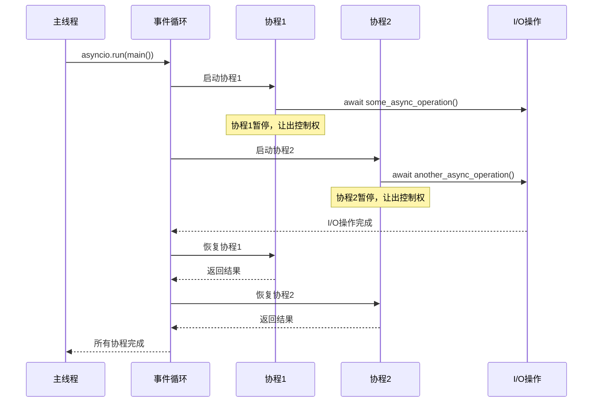
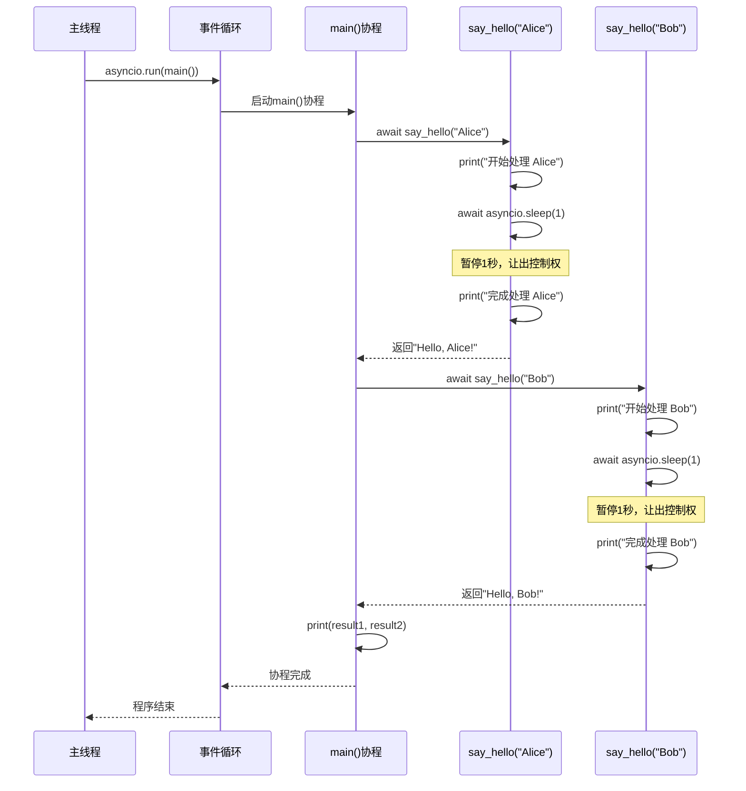
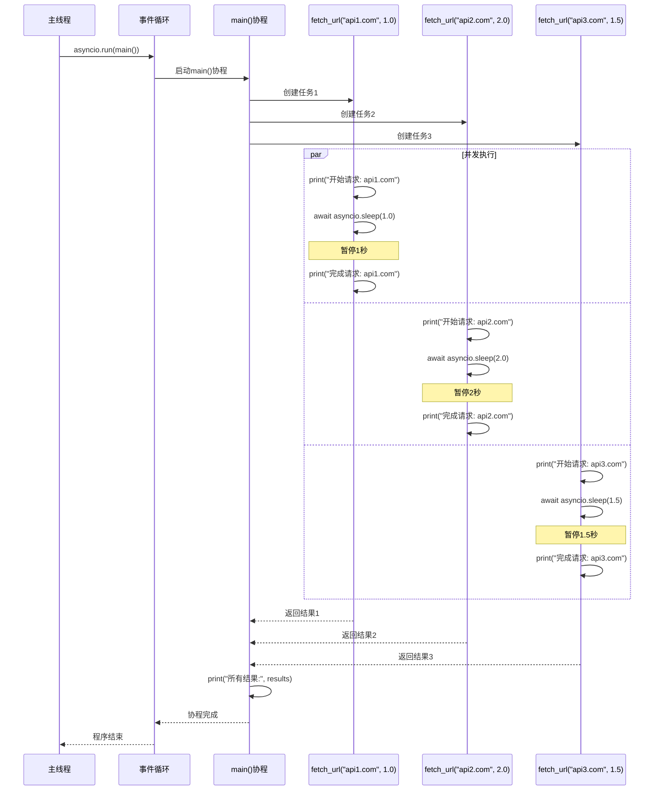
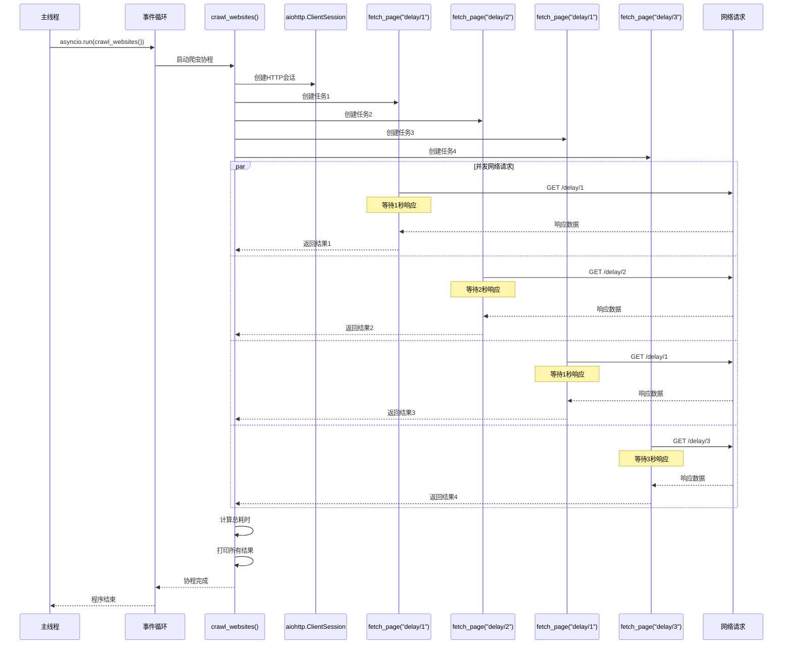
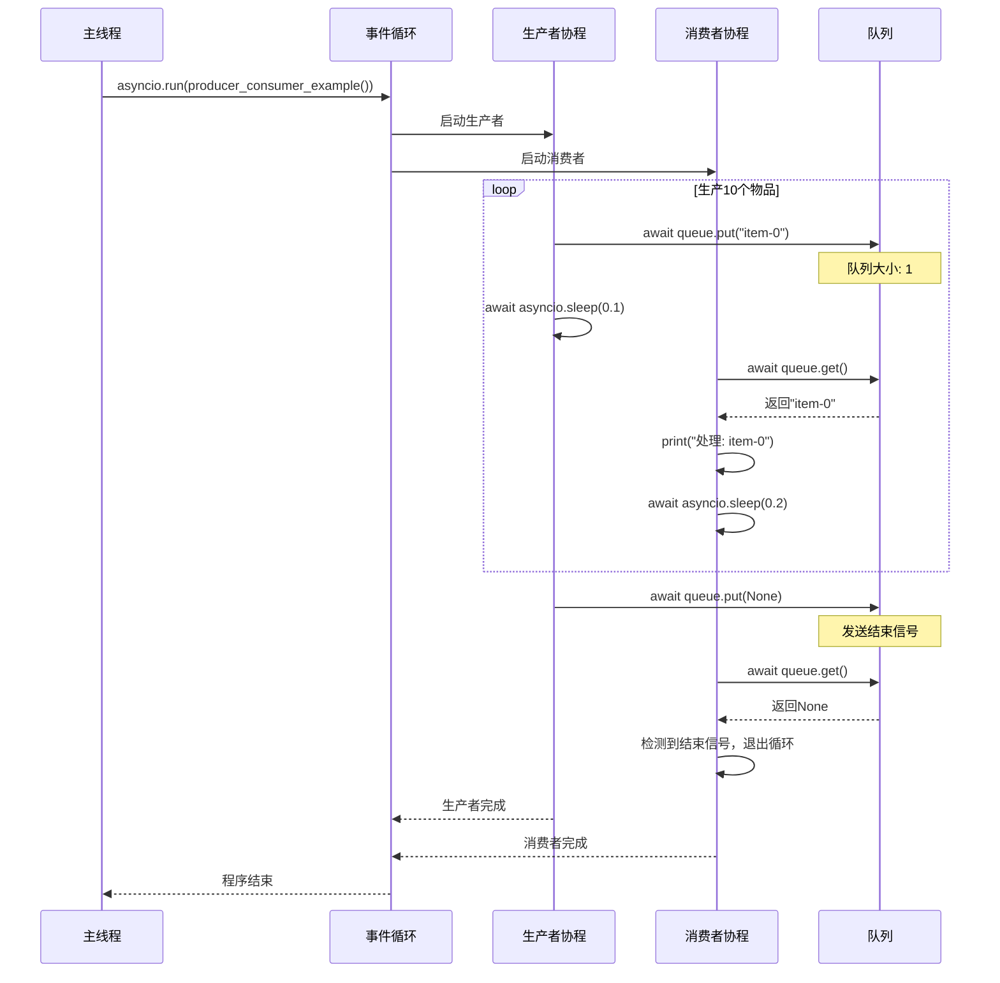
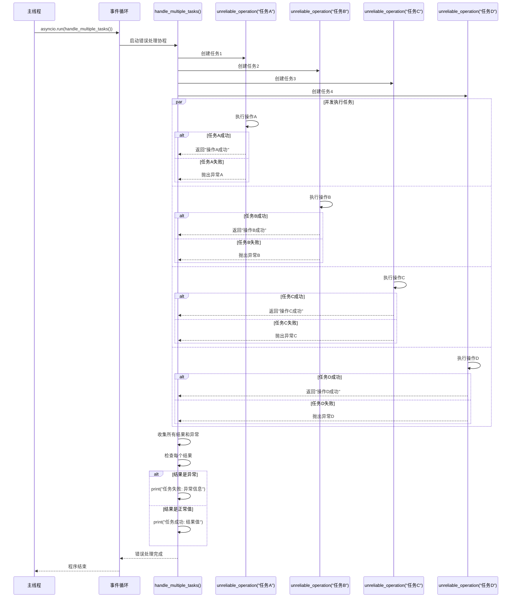

# Python 协程 (async/await) 使用指南 - 带时序图版本

## 1. 原理解释

### 什么是协程？

协程是一种**协作式多任务**的并发模型，它允许在单线程内实现并发执行。与线程的抢占式调度不同，协程通过 `await` 关键字主动让出控制权，实现协作式调度。

### 核心概念

- **事件循环 (Event Loop)**: 协程的调度器，负责管理和执行所有协程
- **async**: 定义异步函数的关键字
- **await**: 等待异步操作完成的关键字
- **协程对象**: 调用 `async` 函数返回的对象，需要被事件循环调度执行

### 工作原理

```python
# 1. 定义异步函数
async def fetch_data():
    # 2. 在异步操作前使用 await
    data = await some_async_operation()
    return data

# 3. 运行协程
result = await fetch_data()  # 在另一个 async 函数中
# 或者
result = asyncio.run(fetch_data())  # 在同步代码中
```

### 协程执行时序图



## 2. 基础示例

### 串行执行示例

```python
import asyncio
import time

async def say_hello(name: str):
    """异步函数示例"""
    print(f"开始处理 {name}")
    await asyncio.sleep(1)  # 模拟异步操作
    print(f"完成处理 {name}")
    return f"Hello, {name}!"

async def main():
    """主协程函数"""
    # 串行执行
    result1 = await say_hello("Alice")
    result2 = await say_hello("Bob")
    print(result1, result2)

if __name__ == "__main__":
    asyncio.run(main())
```

#### 串行执行时序图



### 并发执行示例

```python
import asyncio
import time

async def fetch_url(url: str, delay: float):
    """模拟网络请求"""
    print(f"开始请求: {url}")
    await asyncio.sleep(delay)  # 模拟网络延迟
    print(f"完成请求: {url}")
    return f"Response from {url}"

async def main():
    """并发执行多个异步任务"""
    urls = [
        ("https://api1.com", 1.0),
        ("https://api2.com", 2.0),
        ("https://api3.com", 1.5)
    ]
    
    # 使用 asyncio.gather 并发执行
    tasks = [fetch_url(url, delay) for url, delay in urls]
    results = await asyncio.gather(*tasks)
    print("所有结果:", results)

if __name__ == "__main__":
    asyncio.run(main())
```

#### 并发执行时序图



## 3. 实际应用示例

### 网络爬虫示例

```python
import asyncio
import aiohttp
import time

async def fetch_page(session: aiohttp.ClientSession, url: str):
    """异步获取网页内容"""
    try:
        async with session.get(url) as response:
            content = await response.text()
            return {
                'url': url,
                'status': response.status,
                'content_length': len(content)
            }
    except Exception as e:
        return {'url': url, 'error': str(e)}

async def crawl_websites():
    """并发爬取多个网站"""
    urls = [
        'https://httpbin.org/delay/1',
        'https://httpbin.org/delay/2',
        'https://httpbin.org/delay/1',
        'https://httpbin.org/delay/3'
    ]
    
    start_time = time.time()
    
    async with aiohttp.ClientSession() as session:
        # 创建所有任务
        tasks = [fetch_page(session, url) for url in urls]
        
        # 并发执行所有任务
        results = await asyncio.gather(*tasks, return_exceptions=True)
        
        end_time = time.time()
        
        print(f"总耗时: {end_time - start_time:.2f} 秒")
        for result in results:
            print(result)

if __name__ == "__main__":
    asyncio.run(crawl_websites())
```

#### 网络爬虫并发时序图



## 4. 高级模式

### 生产者-消费者模式

```python
import asyncio
from asyncio import Queue

async def producer(queue: Queue):
    """生产者协程"""
    for i in range(10):
        await queue.put(f"item-{i}")
        await asyncio.sleep(0.1)
    await queue.put(None)  # 结束信号

async def consumer(queue: Queue):
    """消费者协程"""
    while True:
        item = await queue.get()
        if item is None:
            break
        print(f"处理: {item}")
        await asyncio.sleep(0.2)

async def producer_consumer_example():
    queue = Queue(maxsize=5)
    await asyncio.gather(
        producer(queue),
        consumer(queue)
    )

if __name__ == "__main__":
    asyncio.run(producer_consumer_example())
```

#### 生产者-消费者模式时序图



### 错误处理示例

```python
import asyncio
import random

async def unreliable_operation(name: str, success_rate: float = 0.7):
    """不可靠的操作，可能失败"""
    await asyncio.sleep(random.uniform(0.5, 2.0))
    
    if random.random() > success_rate:
        raise Exception(f"操作 {name} 失败") # 抛出异常
    
    return f"操作 {name} 成功"

async def handle_multiple_tasks():
    """处理多个任务的错误"""
    tasks = [
        asyncio.create_task(unreliable_operation("任务A", 0.8)),
        asyncio.create_task(unreliable_operation("任务B", 0.6)),
        asyncio.create_task(unreliable_operation("任务C", 0.9)),
        asyncio.create_task(unreliable_operation("任务D", 0.3))
    ]
    
    # 等待所有完成，收集异常
    results = await asyncio.gather(*tasks, return_exceptions=True) # 允许收集异常结果
    for i, result in enumerate(results): # 处理相关结果异常
        if isinstance(result, Exception):
            print(f"任务 {i+1} 失败: {result}")
        else:
            print(f"任务 {i+1} 成功: {result}")

if __name__ == "__main__":
    asyncio.run(handle_multiple_tasks())
```

#### 错误处理时序图



## 5. 关键要点总结

### 何时使用 async/await

**✅ 适合使用协程的场景：**

- **I/O 密集型应用**: Web 服务器、API 网关、爬虫
- **高并发需求**: 需要处理大量并发连接
- **实时应用**: WebSocket、聊天应用、实时通知
- **微服务架构**: 服务间异步通信

**❌ 不适合使用协程的场景：**

- **CPU 密集型任务**: 数学计算、图像处理、机器学习训练
- **简单的脚本**: 一次性执行的简单任务
- **已有同步代码库**: 重构成本过高

### 重要注意事项

1. **绝对不能使用阻塞操作** - 如 `time.sleep()`, `requests.get()`
2. **async 函数的传染性** - 调用链上的函数都需要是 async
3. **合理错误处理** - 使用 `try-except` 和 `return_exceptions=True`
4. **资源管理** - 使用异步上下文管理器

### 性能优势

| 特性 | 协程 | 线程 | 进程 |
|------|------|------|------|
| **并发能力** | 极高 (数万) | 中等 (数百) | 低 (数十) |
| **内存占用** | 极低 (KB级) | 高 (MB级) | 极高 (GB级) |
| **CPU 占用** | 极低 | 高 | 中等 |
| **适用场景** | I/O 密集型 | 简单并发 | CPU 密集型 |

协程是 Python 异步编程的核心，通过时序图可以更直观地理解其执行流程和并发机制。掌握协程对于构建高性能的现代 Python 应用至关重要。
